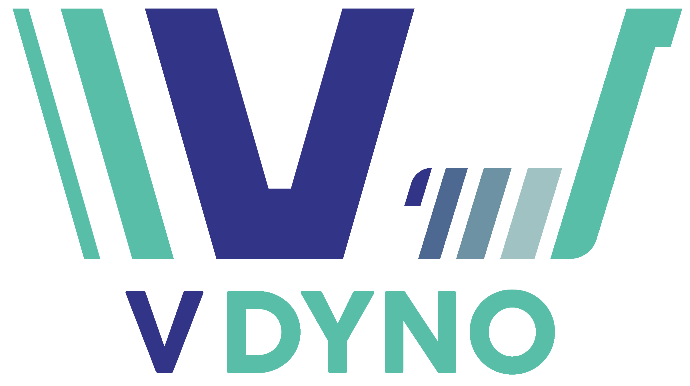
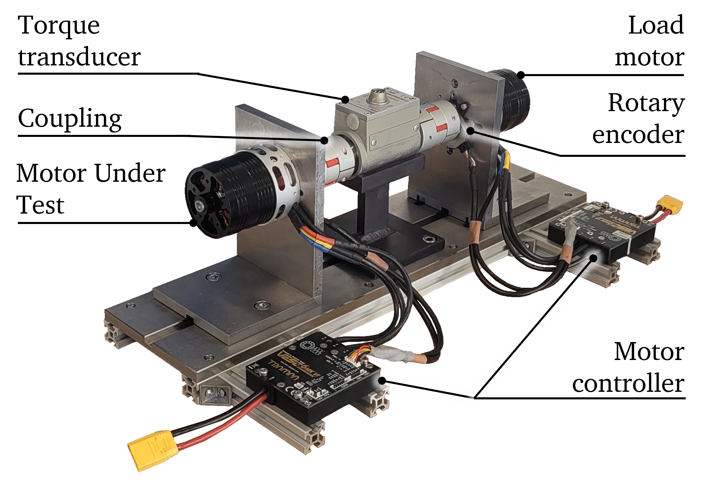

# 

V-Dyno was created as part of a masters group project in 2024/25 at the University of Bristol. It contains all neccessary files to recreate our setup, including the design files and UI (User Interface) that allows users to easily run dynamic tests: VDyno.py.

## Acknowledgements

Motor control possible through VESC platform. 
CAN communication through 'cantools' project.
VDyno/model/CAN/VESC.dbc modified from [Jonas Bareiß's project](https://gitlab.com/jonasbareiss/vesc-dbc).
UI made using PyQT6. Various tutorials, referenced in code, made this possible also. Thank you all.


## Getting Started
To install all development dependencies please run:

```sh
pip install -r requirements.txt
```
VESCs must be setup to enable CAN communication in "VESC mode", updating status 1-4 at your desired rate. We use 50Hz.

Assign Motor Under Test (driving motor) and load motor (driven motor) VESC ID 1 and 2 respectively.
## Usage example
To use the GUI, navigate to VDyno.py and click run.

If you are running without connection to the Dyno (no CAN transceiver), you can run a "dummy" version by uncommenting the second line in the VDyno\model\dyno.py file.

```sh
from VDyno.model.can_handler import CANHandler
#from VDyno.model.dummy_can_handler import CANHandler
```
## Modifying to your setup
Torque sensor factor and offset can be modified in VDyno/model/value_calibration.csv

## /docs - contains all that's not VDyno code
### /Motor Characterisation
Contains the results from two tests carried out where Trampa 6340 motors were rotated externally and their back EMF recorded. Torque_Constant_Calculator contains most of what you need to know

### /mech_design_files
CAD output of precision mechanical setup we developed
# 

## Meta

Daniel Muir – [LinkedIn](https://www.linkedin.com/in/daniel-muir31415/) – danielmuir167@gmail.com

Distributed under the MIT license. See ``LICENSE`` for more information.

[Github page](https://github.com/dan17229/V-Dyno)

## Contributing

1. Fork it (<https://github.com/dan17229/Vdynio/fork>)
2. Create your feature branch (`git checkout -b feature/fooBar`)
3. Commit your changes (`git commit -am 'Add some fooBar'`)
4. Push to the branch (`git push origin feature/fooBar`)
5. Create a new Pull Request

<!-- Markdown link & img dfn's -->
[npm-image]: v
[npm-url]: https://npmjs.org/package/datadog-metrics
[npm-downloads]: https://img.shields.io/npm/dm/datadog-metrics.svg?style=flat-square
[travis-image]: https://img.shields.io/travis/dbader/node-datadog-metrics/master.svg?style=flat-square
[travis-url]: https://travis-ci.org/dbader/node-datadog-metrics
[wiki]: https://github.com/yourname/yourproject/wiki